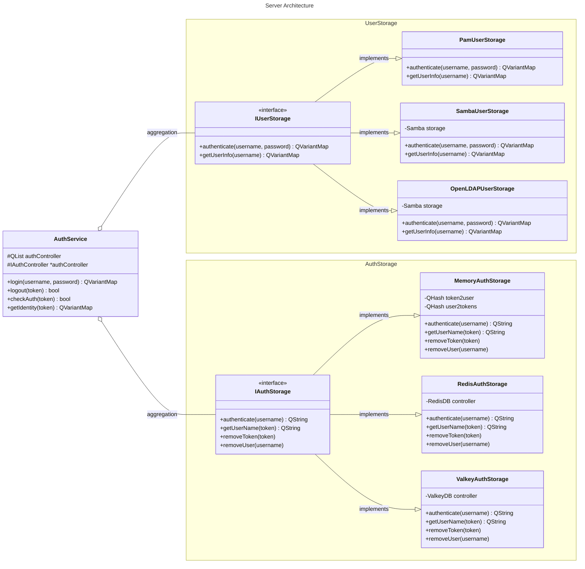

# Авторизация пользователей по Json-rpc

Данный файл описывает способы реализации авторизации пользователей по Json-rpc, где в
качестве сервера используется сервер на `C++`, с использованием `libqjonrpc` и клиент на
`TypeScript`.

## API

- `login` - метод авторизации пользователя
  Тело запроса:
  ```json
  {
    "id": $requestId
    "jsonrpc": "2.0",
    "method": "auth.login",
    "params": [$username, $password]
  }
  ```
  Тело ответа:
  ```json
  {
    "id": $requestId
    "jsonrpc": "2.0",
    "method": "auth.login",
    "result": [$authresponse, $username, $password]
  } 
  ```
  где `$authresponse` - является объектом интерфейса `AuthLoginResponse`:
    ```typescript
    export interface AuthLoginResponse {
      token: string;
      user: User;
    }
    export interface User {
      id?: number;
      [key: string]: any;
    }
    ```
- `logout` - метод выхода пользователя
  Тело запроса:
  ```json
  {
    "jsonrpc": "2.0",
    "method": "auth.logout",
    "params": [$token],
    "id": $requestId
  }
  ```
  Тело ответа:
  ```json
  {
    "jsonrpc": "2.0",
    "method": "auth.logout",
    "result": [$token],
    "id": $requestId
  }
  ```
- `checkAuth` - метод проверки авторизации пользователя
  Тело запроса:
  ```json
  {
    "jsonrpc": "2.0",
    "method": "auth.checkAuth",
    "params": [$token],
    "id": $requestId
  }
  ```
  Тело ответа:
  ```json
  {
    "jsonrpc": "2.0",
    "method": "auth.checkAuth",
    "result": [$isAuth, $token],
    "id": $requestId
  }
  ```
  где `$isAuth` - является значением типа `boolean`,
- `getIdentity` - метод получения данных пользователя
  Тело запроса:
  ```json
  {
    "jsonrpc": "2.0",
    "method": "auth.getIdentity",
    "params": [$token],
    "id": $requestId
  }
  ```
  Тело ответа:
  ```json
  {
    "jsonrpc": "2.0",
    "method": "auth.getIdentity",
    "result": [$user, $token],
    "id": $requestId
  }
  ```
  где `$user` - является объектом интерфейса `User`.

## Архитектура сервера

Сервер состоит из трех абстрактных классов:

- `AuthService` - сервис авторизации пользователей по Json-rpc. Его задачей является
  предоставление интерфейса для взаимодействия с клиентом.
- `IUserStorage` - хранилище пользователей. Его задачей является предоставление интерфейса
  для получения информации о пользователях и их аутентификации.
- `IAuthStorage` - контроллер авторизации пользователей. Его задачей является предоставление
  интерфейса для взаимодействия с хранилищем токенов.



Авторизационному сервису НЕОБХОДИМО и ДОСТАТОЧНО предоставлять минимальное количество
идентификационной информации, в число которое входят:

- Идентификатор пользователя (`id`),
- Имя пользователя (`username`),
- Адрес электронной почты (`email`).

Из которых обязательным является `id`. `id` сначала формируется конкретным `IUserStorage`
с прибавлением в начале названия хранилища перед разделителем `~=`, например `Pam~=1002`, где
`Pam` &mdash; название хранилища, а `1002` &mdash; `id` внутри хранилища. При наличии
пользователя с таким же `username` в другом хранилище, должно быть предусмотрено два варианта
поведения на выбор:

1. Id пользователя составляется из `id` в найденных хранилищах разделенных `;`:
   `Pam~=1002;OpenLDAP~=B6BDE6F5-xxxx-xxxx-xxxx-xxxxxxxxxxxx`
2. Псевдослучайным образом выбирается одно из хранилищ(или первое попавшееся).
3. Относительно приоритета выбирается единственный `id` из найденных.

Пользователь может получить информацию только о своём пользователе, к которому привязан токен
авторизации.

