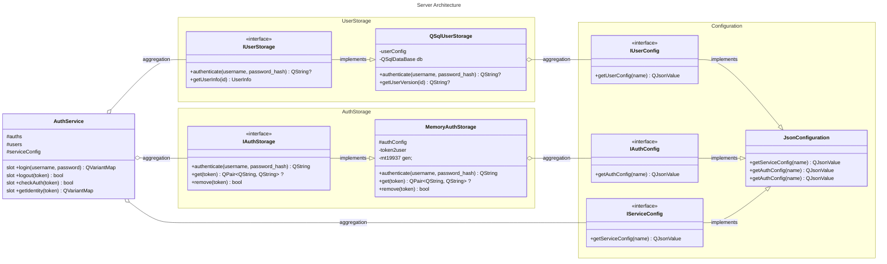

[Russian](/examples/jrpc_auth/README_RU.MD)

### Usage Example

Direct usage:

```c++
// Service configuration
AuthServiceSettings settings;
JsonConfiguration configuration = loadConfiguration();
settings.userStorages.push_back(std::make_unique<QSqlUserStorage>(&configuration));
settings.authStorage = std::make_unique<MemAuthStorage>(&configuration);

// Service creation
auto authService = new AuthService(std::move(settings), &configuration);

// Authentication
auto result = authService->login("username", "password");
if (result.contains("error")) {
    // Error handling
} else {
    QString token = result["token"].toString();
    // Token usage
}

// Authentication check
bool isAuthenticated = authService->checkAuth(token);

// Session termination
authService->logout(token);
```

Creating an HTTP Json-RPC service:

```c++
#include <QtCore>
#include <auth_service.h>
#include <qjsonrpc/qjsonrpchttpserver.h>
#include <user_storage/qsql_user_storage.h>
#include <auth_storage/mem_auth_storage.h>
#include <auth_configuration/json_configuration.h>

int main(int argc, char *argv[]) {
    QCoreApplication app(argc, argv);

    QJsonRpcHttpServer rpcServer;
    AuthServiceSettings authSettings;
    JsonConfiguration configuration = loadConfiguration();

    authSettings.authStorage = std::make_unique<MemAuthStorage>(&configuration);
    authSettings.userStorages.emplace_back(std::move(std::make_unique<QSqlUserStorage>(&configuration)));

    rpcServer.addService(new AuthService(std::move(authSettings), &configuration, &rpcServer));
    if (!rpcServer.listen(QHostAddress::LocalHost, 7777)) {
        qDebug() << "Failed to start Json-RPC HTTP server";
        qDebug() << rpcServer.errorString();
        return 1;
    }

    return app.exec();
}

```

### Authorization verification

The current implementation uses a symmetric signature to verify the authenticity of the token(HS256). The authenticity
of the token is verified by a single "SECRET", which is located in the service configuration (`config.json'). The
current implementation does not provide for the absence of a "SECRET" in the configuration, but this will be fixed in
the future.

### Architecture

#### Architecture Overview

The authentication system is built on a modular architecture, divided into several key components:

- **AuthService** &mdash; the main service providing a JSON-RPC API for authentication
- **IUserStorage** &mdash; interface for interacting with the user storage
- **IAuthStorage** &mdash; interface for interacting with the session storage
- **QSqlUserStorage** &mdash; implementation of IUserStorage for working with an SQL database
- **MemAuthStorage** &mdash; implementation of IAuthStorage for storing sessions in memory



#### Component Details

1. **AuthService** &mdash; the main authentication service, providing the following methods:
    - `login(username, password)` &mdash; user authentication
    - `logout(token)` &mdash; session termination
    - `checkAuth(token)` &mdash; token validity check
    - `getIdentity(token)` &mdash; retrieving user information\
      The service uses dependency injection through
      **AuthServiceSettings**, which allows flexible storage configuration.
2. **IUserStorage** &mdash; interface for interacting with the user storage. Main methods:
    - `authenticate(username, password)` &mdash; user authentication
    - `getUserVersion(username)` &mdash; retrieving user data version
3. **IAuthStorage** &mdash; interface for interacting with the session storage. Main methods:
    - `authenticate(username, userVersion)` &mdash; creating a new session
    - `get(auth_id)` &mdash; retrieving user data by token
    - `remove(auth_id)` &mdash; session deletion
4. **QSqlUserStorage** &mdash; implementation of IUserStorage for working with an SQL database. Supports configuration
   through
   environment variables:
    - `DATABASE_HOST` &mdash; host *(default depends on the driver)*
    - `DATABASE_SCHEMA` &mdash; schema *(default "public")*
    - `DATABASE_DRIVER` &mdash; driver
    - `DATABASE_PORT` &mdash; port *(default depends on the driver)*
    - `DATABASE_NAME` &mdash; name *(default depends on the driver)*
    - `DATABASE_USER` &mdash; user *(default is the username under which the application is run)*
    - `DATABASE_PASSWORD` &mdash; password
5. **MemAuthStorage** &mdash; a simple implementation of **IAuthStorage**, storing data in memory.
   Uses a hash table for quick data access.

### Extending the Authentication Service

#### Creating a Custom User Storage

To create a custom user storage, you need to:

1. Create a class inheriting from **IUserStorage**
2. Implement all virtual interface methods
3. Register the storage in **AuthServiceSettings**

Example:

```c++
class CustomUserStorage : public IUserStorage {
public:
    std::optional<QString> authenticate(const QString &username, const QString &password) override {
        // Authentication implementation
    }

    std::optional<QString> getUserVersion(const QString &username) override {
        // Implementation of retrieving user version
    }
};

// Usage
AuthServiceSettings settings;
settings.userStorages.push_back(std::make_unique<CustomUserStorage>());
auto authService = new AuthService(std::move(settings));
```

#### Creating a Custom Session Storage

To create a custom session storage:

1. Create a class inheriting from **IAuthStorage**
2. Implement all virtual interface methods
3. Set the storage in **AuthServiceSettings**

Example:

```c++
class CustomAuthStorage : public IAuthStorage {
public:
    QString authenticate(const QString &username, const QString &userVersion) override {
        // Token creation implementation
    }

    std::optional<QPair<QString, QString>> get(const QString &auth_id) override {
        // Implementation of retrieving data by token
    }

    bool remove(const QString &auth_id) override {
        // Implementation of token deletion
    }
};

// Usage
AuthServiceSettings settings;
settings.authStorage = std::make_unique<CustomAuthStorage>();
auto authService = new AuthService(std::move(settings));
```

#### Support for Multiple User Storages

The system supports the simultaneous use of multiple user storages.
This allows separating users by different data sources.

Example:

```c++
AuthServiceSettings settings;

// Adding multiple user storages
settings.userStorages.push_back(std::make_unique<QSqlUserStorage>());
settings.userStorages.push_back(std::make_unique<LdapUserStorage>());
settings.userStorages.push_back(std::make_unique<CustomUserStorage>());

// Setting the session storage
settings.authStorage = std::make_unique<MemAuthStorage>();

auto authService = new AuthService(std::move(settings));
```

#### Security

When implementing custom storages, consider:

- Storing passwords in encrypted/hashed form
- Using salt during hashing
- Validating input data

#### Writing a Client Application

```typescript
type JRPCResponse = {
    jsonrpc: string;
    error: any | undefined;
    id: number;
    result: LoginResponse | IdentityResponse | boolean | undefined;
};
type LoginResponse = {
    token: string;
    user: IdentityResponse;
};
type IdentityResponse = {
    username: string;
};

/**
 * Perform a JSON-RPC request to login on the server
 *
 * @param {string} username user name
 * @param {string} password user password
 * @returns A promise that resolves with the JSON response from the server
 */
async function jrpc_auth_login(username: string, password: string): Promise<string> {
    const request = {
        jsonrpc: "2.0",
        method: "auth.login",
        params: [username, password],
        id: 1
    };

    const response = await fetch('http://127.0.0.1:7777', {
        method: 'POST',
        headers: {
            'Content-Type': 'application/json',
            'Accept': 'application/json'
        },
        body: JSON.stringify(request),
        signal: AbortSignal.timeout(10000) // 10 second timeout
    });

    if (!response.ok) {
        throw new Error(`HTTP error! status: ${response.status}`);
    }

    const json: JRPCResponse = await response.json();
    if (json.error) {
        throw new Error(`JSON-RPC error: ${json.error.message}`);
    }
    const result: LoginResponse = json.result;

    return result.token;
}

/**
 * Perform a JSON-RPC request to logout on the server
 *
 * @param {string} token user token
 * @returns A promise that resolves with the JSON response from the server
 */
async function jrpc_auth_logout(token: string): Promise<boolean> {
    const request = {
        jsonrpc: "2.0",
        method: "auth.logout",
        params: [token],
        id: 1
    };

    const response = await fetch('http://127.0.0.1:7777', {
        method: 'POST',
        headers: {
            'Content-Type': 'application/json',
            'Accept': 'application/json'
        },
        body: JSON.stringify(request),
        signal: AbortSignal.timeout(10000) // 10 second timeout
    });

    if (!response.ok) {
        throw new Error(`HTTP error! status: ${response.status}`);
    }

    const json: JRPCResponse = await response.json();
    if (json.error) {
        throw new Error(`JSON-RPC error: ${json.error.message}`);
    }
    const result: boolean = json.result;

    return result;
}

/**
 * Perform a JSON-RPC request to get user identity on the server
 *
 * @param {string} token user token
 * @returns A promise that resolves with the JSON response from the server
 */
async function jrpc_auth_identity(token: string): Promise<IdentityResponse> {
    const request = {
        jsonrpc: "2.0",
        method: "auth.getIdentity",
        params: [token],
        id: 1
    };

    const response = await fetch('http://127.0.0.1:7777', {
        method: 'POST',
        headers: {
            'Content-Type': 'application/json',
            'Accept': 'application/json'
        },
        body: JSON.stringify(request),
        signal: AbortSignal.timeout(10000) // 10 second timeout
    });

    if (!response.ok) {
        throw new Error(`HTTP error! status: ${response.status}`);
    }

    const json: JRPCResponse = await response.json();
    if (json.error) {
        throw new Error(`JSON-RPC error: ${json.error.message}`);
    }
    const result: IdentityResponse = json.result;

    return result;
}

/**
 * Perform a JSON-RPC request to check authentication on the server
 *
 * @param {string} token user token
 * @returns A promise that resolves with the JSON response from the server
 */
async function jrpc_auth_check(token: string): Promise<boolean> {
    const request = {
        jsonrpc: "2.0",
        method: "auth.checkAuth",
        params: [token],
        id: 1
    };

    const response = await fetch('http://127.0.0.1:7777', {
        method: 'POST',
        headers: {
            'Content-Type': 'application/json',
            'Accept': 'application/json'
        },
        body: JSON.stringify(request),
        signal: AbortSignal.timeout(10000) // 10 second timeout
    });

    if (!response.ok) {
        throw new Error(`HTTP error! status: ${response.status}`);
    }

    const json: JRPCResponse = await response.json();
    if (json.error) {
        throw new Error(`JSON-RPC error: ${json.error.message}`);
    }
    const result: boolean = json.result;

    return result;
}
```