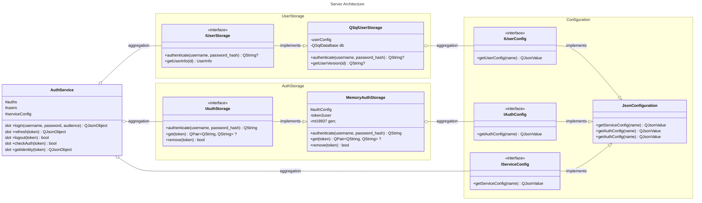

[English](/examples/jrpc_double_token_auth/README.MD)

### Пример использования

Использование "напрямую":

```c++
// Настройка сервиса
AuthServiceSettings settings;
settings.userStorages.push_back(std::make_unique<QSqlUserStorage>());
settings.authStorage = std::make_unique<MemAuthStorage>();

// Создание сервиса
auto authService = new AuthService(std::move(settings));

// Аутентификация
auto result = authService->login("username", "password");
if (result.contains("error")) {
    // Обработка ошибки
} else {
    QString token = result["token"].toString();
    // Использование токена
}

// Проверка аутентификации
bool isAuthenticated = authService->checkAuth(token);

// Завершение сессии
authService->logout(token);
```

Создание HTTP Json-RPC сервиса:

```c++
#include <QtCore>
#include <auth_service.h>
#include <qjsonrpc/qjsonrpchttpserver.h>
#include <user_storage/qsql_user_storage.h>
#include <auth_storage/mem_auth_storage.h>


int main() {
   QCoreApplication app(argc, argv);
   
   QJsonRpcHttpServer rpcServer;
   AuthServiceSettings authSettings;
   
   authSettings.authStorage = std::make_unique<MemAuthStorage>();
   authSettings.userStorages.emplace_back(std::move(std::make_unique<QSqlUserStorage>()));
   
   rpcServer.addService(new AuthService(std::move(authSettings), &rpcServer));
   if (!rpcServer.listen(QHostAddress::LocalHost, 7777)) {
      std::cerr << "Failed to start server" << std::endl;
      return 1;
   }
   
   return app.exec();
}
```

### Верификация авторизации

Данная реализация аутентификации использует алгоритм подписи RS256. Верификация токена осуществляется
публичным ключом. Токены имеют ограниченную длительность жизни. При аутентификации выдаются два токена:
access и refresh. Access токен используется для обращений к ресурсам, а refresh токен используется для
обновления access токена. При работе с токенами, рекомендуется отклонять любые rerfesh токены, так как
они предназначены для обновления access токена и должны являться одноразовыми.

### Архитектура

#### Обзор архитектуры

Система аутентификации построена по модульной архитектуре, разделенной на несколько ключевых компонентов:

- **AuthService** &mdash; основной сервис, предоставляющий JSON-RPC API для аутентификации
- **IUserStorage** &mdash; интерфейс для работы с хранилищем пользователей
- **IAuthStorage** &mdash; интерфейс для работы с хранилищем сессий
- **QSqlUserStorage** &mdash; реализация IUserStorage для работы с SQL-базой данных
- **MemAuthStorage** &mdash; реализация IAuthStorage для хранения сессий в памяти



#### Детали компонентов

1. **AuthService** &mdash; основной сервис аутентификации, предоставляющий следующие методы:
    - `login(username, password, audience)` &mdash; аутентификация пользователя для сервиса `audience`
    - `refresh(token)` &mdash; получение нового `access` и `refresh` токена
    - `logout(token)` &mdash; завершение сессии
    - `checkAuth(token)` &mdash; проверка валидности токена
    - `getIdentity(token)` &mdash; получение информации о пользователе\
      Сервис использует внедрение зависимостей через
      **AuthServiceSettings**, что позволяет гибко настраивать хранилища.
2. **IUserStorage** &mdash; интерфейс для работы с хранилищем пользователей. Основные методы:
    - `authenticate(username, password)` &mdash; аутентификация пользователя
    - `getUserVersion(username)` &mdash; получение версии пользовательских данных
3. **IAuthStorage** &mdash; интерфейс для работы с хранилищем сессий. Основные методы:
    - `authenticate(username, userVersion)` &mdash; создание новой сессии
    - `get(auth_id)` &mdash; получение данных пользователя по токену
    - `remove(auth_id)` &mdash; удаление сессии
4. **QSqlUserStorage** &mdash; реализация IUserStorage для работы с SQL-базой данных. Поддерживает настройку через
   переменные окружения:
    - `DATABASE_HOST` &mdash; хост *(по умолчанию в зависимости от драйвера)*
    - `DATABASE_SCHEMA` &mdash; схема *(по умолчанию "public")*
    - `DATABASE_DRIVER` &mdash; драйвер
    - `DATABASE_PORT` &mdash; порт *(по умолчанию в зависимости от драйвера)*
    - `DATABASE_NAME` &mdash; имя *(по умолчанию зависит от драйвера)*
    - `DATABASE_USER` &mdash; пользователь *(по умолчанию имя пользователя от которого запущено приложение)*
    - `DATABASE_PASSWORD` &mdash; пароль
5. **MemAuthStorage** &mdash; простая реализация **IAuthStorage**, хранящая данные в оперативной памяти.
   Использует хеш-таблицу для быстрого доступа к данным.

### Расширение сервиса аутентификации

#### Создание собственного хранилища пользователей

Для создания собственного хранилища пользователей необходимо:

1. Создать класс, наследующийся от **IUserStorage**
2. Реализовать все виртуальные методы интерфейса
3. Зарегистрировать хранилище в **AuthServiceSettings**

Пример:

```c++
class CustomUserStorage : public IUserStorage {
public:
    std::optional<QString> authenticate(const QString &username, const QString &password) override {
        // Реализация аутентификации
    }

    std::optional<QString> getUserVersion(const QString &username) override {
        // Реализация получения версии пользователя
    }
};

// Использование
AuthServiceSettings settings;
settings.userStorages.push_back(std::make_unique<CustomUserStorage>());
auto authService = new AuthService(std::move(settings));
```

#### Создание собственного хранилища сессий

Для создания собственного хранилища сессий:

1. Создать класс, наследующийся от **IAuthStorage**
2. Реализовать все виртуальные методы интерфейса
3. Установить хранилище в **AuthServiceSettings**

Пример:

```c++
class CustomAuthStorage : public IAuthStorage {
public:
    QString authenticate(const QString &username, const QString &userVersion) override {
        // Реализация создания токена
    }

    std::optional<QPair<QString, QString>> get(const QString &auth_id) override {
        // Реализация получения данных по токену
    }

    bool remove(const QString &auth_id) override {
        // Реализация удаления токена
    }
};

// Использование
AuthServiceSettings settings;
settings.authStorage = std::make_unique<CustomAuthStorage>();
auto authService = new AuthService(std::move(settings));
```

#### Поддержка нескольких хранилищ пользователей

Система поддерживает использование нескольких хранилищ пользователей одновременно.
Это позволяет разделять пользователей по разным источникам данных

Пример:

```c++
AuthServiceSettings settings;

// Добавляем несколько хранилищ пользователей
settings.userStorages.push_back(std::make_unique<QSqlUserStorage>());
settings.userStorages.push_back(std::make_unique<LdapUserStorage>());
settings.userStorages.push_back(std::make_unique<CustomUserStorage>());

// Устанавливаем хранилище сессий
settings.authStorage = std::make_unique<MemAuthStorage>();

auto authService = new AuthService(std::move(settings));
```

#### Безопасность

При реализации собственных хранилищ следует учитывать:

- Хранение паролей в зашифрованном/закэшированном виде
- Использование соли при хешировании
- Валидацию входных данных

#### Написание клиентского приложения

```typescript
type JRPCResponse = {
    jsonrpc: string;
    error: any | undefined;
    id: number;
    result: LoginResponse | IdentityResponse | boolean | undefined;
};
type LoginResponse = {
    access: string;
    refresh: string;
    user: IdentityResponse;
};
type IdentityResponse = {
    username: string;
};

/**
 * Perform a JSON-RPC request to login on the server
 *
 * @param {string} username user name
 * @param {string} password user password
 * @returns A promise that resolves with the JSON response from the server
 */
async function jrpc_auth_login(username: string, password: string): Promise<LoginResponse> {
    const request = {
        jsonrpc: "2.0",
        method: "auth.login",
        params: [username, password],
        id: 1
    };

    const response = await fetch('http://127.0.0.1:7777', {
        method: 'POST',
        headers: {
            'Content-Type': 'application/json',
            'Accept': 'application/json'
        },
        body: JSON.stringify(request),
        signal: AbortSignal.timeout(10000) // 10 second timeout
    });

    if (!response.ok) {
        throw new Error(`HTTP error! status: ${response.status}`);
    }

    const json: JRPCResponse = await response.json();
    if (json.error) {
        throw new Error(`JSON-RPC error: ${json.error.message}`);
    }

    return json.result;
}

/**
 * Perform a JSON-RPC request to refresh token on the server
 *
 * @param {string} refresh user refresh token
 * @returns A promise that resolves with the JSON response from the server
 */
async function jrpc_auth_refresh(refresh: string): Promise<LoginResponse> {
    const request = {
        jsonrpc: "2.0",
        method: "auth.refresh",
        params: [refresh],
        id: 1
    };

    const response = await fetch('http://127.0.0.1:7777', {
        method: 'POST',
        headers: {
            'Content-Type': 'application/json',
            'Accept': 'application/json'
        },
        body: JSON.stringify(request),
        signal: AbortSignal.timeout(10000) // 10 second timeout
    });

    if (!response.ok) {
        throw new Error(`HTTP error! status: ${response.status}`);
    }

    const json: JRPCResponse = await response.json();
    if (json.error) {
        throw new Error(`JSON-RPC error: ${json.error.message}`);
    }

    return json.result;
}

/**
 * Perform a JSON-RPC request to logout on the server
 *
 * @param {string} token user token
 * @returns A promise that resolves with the JSON response from the server
 */
async function jrpc_auth_logout(token: string): Promise<boolean> {
    const request = {
        jsonrpc: "2.0",
        method: "auth.logout",
        params: [token],
        id: 1
    };

    const response = await fetch('http://127.0.0.1:7777', {
        method: 'POST',
        headers: {
            'Content-Type': 'application/json',
            'Accept': 'application/json'
        },
        body: JSON.stringify(request),
        signal: AbortSignal.timeout(10000) // 10 second timeout
    });

    if (!response.ok) {
        throw new Error(`HTTP error! status: ${response.status}`);
    }

    const json: JRPCResponse = await response.json();
    if (json.error) {
        throw new Error(`JSON-RPC error: ${json.error.message}`);
    }
    const result: boolean = json.result;

    return result;
}

/**
 * Perform a JSON-RPC request to get user identity on the server
 *
 * @param {string} token user token
 * @returns A promise that resolves with the JSON response from the server
 */
async function jrpc_auth_identity(token: string): Promise<IdentityResponse> {
    const request = {
        jsonrpc: "2.0",
        method: "auth.getIdentity",
        params: [token],
        id: 1
    };

    const response = await fetch('http://127.0.0.1:7777', {
        method: 'POST',
        headers: {
            'Content-Type': 'application/json',
            'Accept': 'application/json'
        },
        body: JSON.stringify(request),
        signal: AbortSignal.timeout(10000) // 10 second timeout
    });

    if (!response.ok) {
        throw new Error(`HTTP error! status: ${response.status}`);
    }

    const json: JRPCResponse = await response.json();
    if (json.error) {
        throw new Error(`JSON-RPC error: ${json.error.message}`);
    }
    const result: IdentityResponse = json.result;

    return result;
}

/**
 * Perform a JSON-RPC request to check authentication on the server
 *
 * @param {string} token user token
 * @returns A promise that resolves with the JSON response from the server
 */
async function jrpc_auth_check(token: string): Promise<boolean> {
    const request = {
        jsonrpc: "2.0",
        method: "auth.checkAuth",
        params: [token],
        id: 1
    };

    const response = await fetch('http://127.0.0.1:7777', {
        method: 'POST',
        headers: {
            'Content-Type': 'application/json',
            'Accept': 'application/json'
        },
        body: JSON.stringify(request),
        signal: AbortSignal.timeout(10000) // 10 second timeout
    });

    if (!response.ok) {
        throw new Error(`HTTP error! status: ${response.status}`);
    }

    const json: JRPCResponse = await response.json();
    if (json.error) {
        throw new Error(`JSON-RPC error: ${json.error.message}`);
    }
    const result: boolean = json.result;

    return result;
}
```